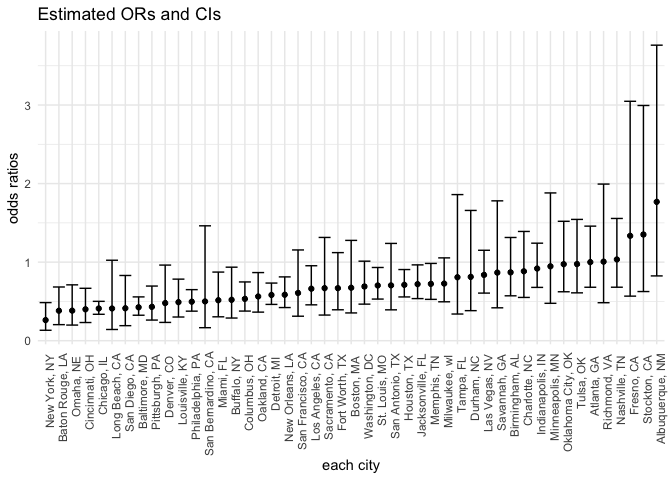
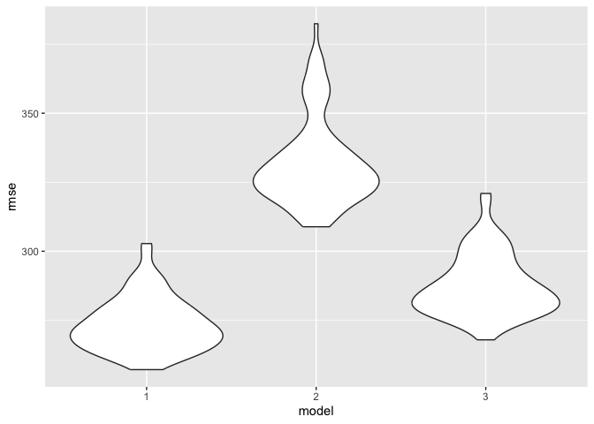

p8105_hw6_ly2633
================
Leila Yan
2024-11-18

``` r
# Load libraries
library(tidyverse)
```

    ## ── Attaching core tidyverse packages ──────────────────────── tidyverse 2.0.0 ──
    ## ✔ dplyr     1.1.4     ✔ readr     2.1.5
    ## ✔ forcats   1.0.0     ✔ stringr   1.5.1
    ## ✔ ggplot2   3.5.1     ✔ tibble    3.2.1
    ## ✔ lubridate 1.9.3     ✔ tidyr     1.3.1
    ## ✔ purrr     1.0.2     
    ## ── Conflicts ────────────────────────────────────────── tidyverse_conflicts() ──
    ## ✖ dplyr::filter() masks stats::filter()
    ## ✖ dplyr::lag()    masks stats::lag()
    ## ℹ Use the conflicted package (<http://conflicted.r-lib.org/>) to force all conflicts to become errors

``` r
library(ggplot2)
library(modelr)
library(broom)
```

    ## 
    ## Attaching package: 'broom'
    ## 
    ## The following object is masked from 'package:modelr':
    ## 
    ##     bootstrap

``` r
library(purrr)
```

# Problem 2

Create a city_state variable (e.g. “Baltimore, MD”), and a binary
variable indicating whether the homicide is solved. Omit cities Dallas,
TX; Phoenix, AZ; and Kansas City, MO – these don’t report victim race.
Also omit Tulsa, AL – this is a data entry mistake. For this problem,
limit your analysis those for whom victim_race is white or black. Be
sure that victim_age is numeric.

``` r
# load the data
# create a city_state variable and a binary variable indicating whether the homicide is solved
homicide_data = 
  read.csv("homicide-data.csv") %>%
  janitor::clean_names()


homicide_data = homicide_data %>%
  mutate(city_state = str_c(city,", ",state),
         victim_age = as.numeric(victim_age),
         homicide_status = ifelse(disposition == "Closed by arrest", 1, 0)) %>% 
  filter(
    !city_state %in% c("Dallas, TX","Phoenix, AZ", "Kansas City, MO","Tulsa, AL"),
    victim_race %in% c("White", "Black")
    ) 
```

    ## Warning: There was 1 warning in `mutate()`.
    ## ℹ In argument: `victim_age = as.numeric(victim_age)`.
    ## Caused by warning:
    ## ! NAs introduced by coercion

For the city of Baltimore, MD, use the glm function to fit a logistic
regression with resolved vs unresolved as the outcome and victim age,
sex and race as predictors. Save the output of glm as an R object; apply
the broom::tidy to this object; and obtain the estimate and confidence
interval of the adjusted odds ratio for solving homicides comparing male
victims to female victims keeping all other variables fixed.

``` r
# Use glm function to fit a logistic regression with resolved vs unresolved as the outcome sand victim age, sex and race as predictors
baltimore = 
  homicide_data %>%  
  filter(city_state == "Baltimore, MD") 

# Apply the broom::tidy to this object; and obtain the estimate and confidence interval of the adjusted odds ratio for solving homicides comparing male victims to female victims keeping all other variables fixed.
logistic_regression = 
  glm(homicide_status ~ victim_age + victim_sex + victim_race, data = baltimore, family = binomial()) %>% 
  broom::tidy(conf.int = TRUE, conf.level = 0.95)

OR = logistic_regression %>%
  mutate(
    OR = exp(estimate),
    confidence_interval_low = exp(conf.low),
    confidence_interval_high = exp(conf.high)
  ) %>% 
  filter(term == "victim_sexMale") %>% 
  select(OR, confidence_interval_low, confidence_interval_high, p.value) %>%  
  knitr::kable(digits = 3)
```

Now run glm for each of the cities in your dataset, and extract the
adjusted odds ratio (and CI) for solving homicides comparing male
victims to female victims. Do this within a “tidy” pipeline, making use
of purrr::map, list columns, and unnest as necessary to create a
dataframe with estimated ORs and CIs for each city.

``` r
glm_each_city <- homicide_data %>%
  group_by(city_state) %>%
  nest() 
  
glm_each_city = glm_each_city %>% 
  mutate(
    fit = map(data, ~ glm(homicide_status ~victim_age + victim_sex + victim_race, data = ., family = binomial())),
    results = map(fit, ~ broom::tidy(.x, conf.int = TRUE, conf.level = 0.95) %>%
      filter(term == "victim_sexMale") %>%
        mutate(
          OR = exp(estimate),
          confidence_interval_low = exp(conf.low),
          confidence_interval_high = exp(conf.high)
        ) %>% 
      select(OR, confidence_interval_low, confidence_interval_high, p.value))
  ) %>%
  unnest(results) %>% 
  select(OR, confidence_interval_low, confidence_interval_high, p.value)
```

    ## Warning: There were 44 warnings in `mutate()`.
    ## The first warning was:
    ## ℹ In argument: `results = map(...)`.
    ## ℹ In group 1: `city_state = "Albuquerque, NM"`.
    ## Caused by warning:
    ## ! glm.fit: fitted probabilities numerically 0 or 1 occurred
    ## ℹ Run `dplyr::last_dplyr_warnings()` to see the 43 remaining warnings.

    ## Adding missing grouping variables: `city_state`

``` r
glm_each_city  %>%
  knitr::kable(digits = 3)
```

| city_state         |    OR | confidence_interval_low | confidence_interval_high | p.value |
|:-------------------|------:|------------------------:|-------------------------:|--------:|
| Albuquerque, NM    | 1.767 |                   0.825 |                    3.762 |   0.139 |
| Atlanta, GA        | 1.000 |                   0.680 |                    1.458 |   1.000 |
| Baltimore, MD      | 0.426 |                   0.324 |                    0.558 |   0.000 |
| Baton Rouge, LA    | 0.381 |                   0.204 |                    0.684 |   0.002 |
| Birmingham, AL     | 0.870 |                   0.571 |                    1.314 |   0.511 |
| Boston, MA         | 0.674 |                   0.353 |                    1.277 |   0.226 |
| Buffalo, NY        | 0.521 |                   0.288 |                    0.936 |   0.029 |
| Charlotte, NC      | 0.884 |                   0.551 |                    1.391 |   0.600 |
| Chicago, IL        | 0.410 |                   0.336 |                    0.501 |   0.000 |
| Cincinnati, OH     | 0.400 |                   0.231 |                    0.667 |   0.001 |
| Columbus, OH       | 0.532 |                   0.377 |                    0.748 |   0.000 |
| Denver, CO         | 0.479 |                   0.233 |                    0.962 |   0.041 |
| Detroit, MI        | 0.582 |                   0.462 |                    0.734 |   0.000 |
| Durham, NC         | 0.812 |                   0.382 |                    1.658 |   0.576 |
| Fort Worth, TX     | 0.669 |                   0.394 |                    1.121 |   0.131 |
| Fresno, CA         | 1.335 |                   0.567 |                    3.048 |   0.496 |
| Houston, TX        | 0.711 |                   0.557 |                    0.906 |   0.006 |
| Indianapolis, IN   | 0.919 |                   0.678 |                    1.241 |   0.582 |
| Jacksonville, FL   | 0.720 |                   0.536 |                    0.965 |   0.028 |
| Las Vegas, NV      | 0.837 |                   0.606 |                    1.151 |   0.278 |
| Long Beach, CA     | 0.410 |                   0.143 |                    1.024 |   0.072 |
| Los Angeles, CA    | 0.662 |                   0.457 |                    0.954 |   0.028 |
| Louisville, KY     | 0.491 |                   0.301 |                    0.784 |   0.003 |
| Memphis, TN        | 0.723 |                   0.526 |                    0.984 |   0.042 |
| Miami, FL          | 0.515 |                   0.304 |                    0.873 |   0.013 |
| Milwaukee, wI      | 0.727 |                   0.495 |                    1.054 |   0.098 |
| Minneapolis, MN    | 0.947 |                   0.476 |                    1.881 |   0.876 |
| Nashville, TN      | 1.034 |                   0.681 |                    1.556 |   0.873 |
| New Orleans, LA    | 0.585 |                   0.422 |                    0.812 |   0.001 |
| New York, NY       | 0.262 |                   0.133 |                    0.485 |   0.000 |
| Oakland, CA        | 0.563 |                   0.364 |                    0.867 |   0.009 |
| Oklahoma City, OK  | 0.974 |                   0.623 |                    1.520 |   0.908 |
| Omaha, NE          | 0.382 |                   0.199 |                    0.711 |   0.003 |
| Philadelphia, PA   | 0.496 |                   0.376 |                    0.650 |   0.000 |
| Pittsburgh, PA     | 0.431 |                   0.263 |                    0.696 |   0.001 |
| Richmond, VA       | 1.006 |                   0.483 |                    1.994 |   0.987 |
| San Antonio, TX    | 0.705 |                   0.393 |                    1.238 |   0.230 |
| Sacramento, CA     | 0.669 |                   0.326 |                    1.314 |   0.255 |
| Savannah, GA       | 0.867 |                   0.419 |                    1.780 |   0.697 |
| San Bernardino, CA | 0.500 |                   0.166 |                    1.462 |   0.206 |
| San Diego, CA      | 0.413 |                   0.191 |                    0.830 |   0.017 |
| San Francisco, CA  | 0.608 |                   0.312 |                    1.155 |   0.134 |
| St. Louis, MO      | 0.703 |                   0.530 |                    0.932 |   0.014 |
| Stockton, CA       | 1.352 |                   0.626 |                    2.994 |   0.447 |
| Tampa, FL          | 0.808 |                   0.340 |                    1.860 |   0.619 |
| Tulsa, OK          | 0.976 |                   0.609 |                    1.544 |   0.917 |
| Washington, DC     | 0.690 |                   0.465 |                    1.012 |   0.061 |

Create a plot that shows the estimated ORs and CIs for each city.
Organize cities according to estimated OR, and comment on the plot.

``` r
glm_each_city %>% 
  ggplot(aes(x=reorder(city_state, OR), y = OR))+
  geom_point()+
  geom_errorbar(aes(ymin = confidence_interval_low, ymax = confidence_interval_high))+
  labs(
    title = "Estimated ORs and CIs", 
    x = "each city", 
    y = "odds ratios"
  )+
  theme_minimal()+
  theme(axis.text.x=element_text(angle = 90, hjust =0.9))
```

<!-- -->

# Problem 3

Load and clean the data for regression analysis (i.e. convert numeric to
factor where appropriate, check for missing data, etc.).

``` r
birthweight_data = 
  read_csv("birthweight.csv", show_col_types = FALSE) %>%
  janitor::clean_names() %>%
  mutate(
    babysex = factor(babysex, levels = c(1, 2), labels = c("Male", "Female")),
    malform = factor(malform, levels = c(0, 1), labels = c("Absent", "Present")),
    mrace = factor(mrace, levels = c(1, 2, 3, 4, 8), 
                   labels = c("White", "Black", "Asian", "Puerto Rican", "Other")),
    frace = factor(frace, levels = c(1, 2, 3, 4, 8, 9), 
                   labels = c("White", "Black", "Asian", "Puerto Rican", "Other", "Unknown"))
  )

# check for missing data
sum(is.na(birthweight_data))
```

    ## [1] 0

Propose a regression model for birthweight. This model may be based on a
hypothesized structure for the factors that underly birthweight, on a
data-driven model-building process, or a combination of the two.
Describe your modeling process and show a plot of model residuals
against fitted values – use add_predictions and add_residuals in making
this plot.

``` r
# propose a regression model
birthwt_model <- lm(
  bwt ~  delwt + fincome + ppbmi + wtgain + frace + gaweeks + malform + bhead + blength + menarche + mheight + momage + mrace + pnumlbw + smoken, data = birthweight_data
  )

# plot residuals against fitted values 
birthwt_plot <-
  birthweight_data %>%
  add_predictions(birthwt_model) %>%
  add_residuals(birthwt_model) %>%
  ggplot(aes(x = pred, y = resid)) +
  geom_point(alpha = 0.5) + 
  geom_point(size = 0.5, color = "blue") +
  geom_smooth(method = "lm", color = "pink") + 
    labs(title = "residuals vs. fitted values", 
       x = "Predicted", 
       y = "Residuals") + theme_minimal()
```

Compare your model to two others:

One using length at birth and gestational age as predictors (main
effects only) One using head circumference, length, sex, and all
interactions (including the three-way interaction) between these Make
this comparison in terms of the cross-validated prediction error; use
crossv_mc and functions in purrr as appropriate.

``` r
# model comparison
model_1 = lm(bwt ~ babysex + bhead + blength + delwt + gaweeks + mrace + parity + smoken, data = birthweight_data)
model_2 = lm(bwt ~ blength + gaweeks, data = birthweight_data)
model_3 = lm(bwt ~ bhead * blength * babysex, data = birthweight_data)

cv_prediction = crossv_mc(birthweight_data, 100) %>%
  mutate(
    train = map(train, as_tibble),
    test = map(test, as_tibble)
  )
  
cv_prediction = cv_prediction %>%
  mutate(
    model_1  =  map(train, \(birthweight_data) lm(formula(model_1), data = birthweight_data)),
    model_2 =  map(train, \(birthweight_data) lm(formula(model_2), data = birthweight_data)),
    model_3 =  map(train, \(birthweight_data) lm(formula(model_3), data = birthweight_data))
  ) |> 
  mutate(
    rmse_1 = map2_dbl(model_1 , test, rmse),
    rmse_2 = map2_dbl(model_2, test, rmse),
    rmse_3 = map2_dbl(model_3, test, rmse)
  )


cv_prediction %>%  
  select(starts_with("rmse")) %>%  
  pivot_longer(
    everything(),
    names_to = "model", 
    values_to = "rmse",
    names_prefix = "rmse_") %>%  
  mutate(model = fct_inorder(model)) %>%  
  ggplot(aes(x = model, y = rmse)) + 
  geom_violin()
```

<!-- -->
